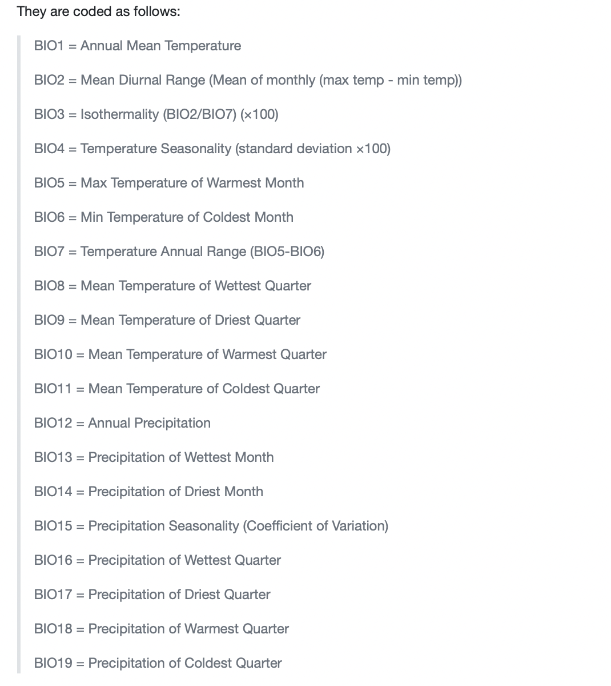

# Species Distribution Modelling
Species distribution modeling (SDM) is a statistical approach used to predict the potential distribution of a species based on environmental variables.
It can help in identifying suitable habitats for species or at risk of MBD transmission, guiding surveillance efforts, and predicting the impacts of climate change.
In this exercise we used MaxEnt algorithms to estimate suitable area for the establishment of *"Aedes albopictus"*
The occurrence records were downloaded from the the paper of Kraemer et al., 2015

## Settings
### Load required libraries and create folders
```{r library, message=FALSE, warning=FALSE}
#load R-Packages
library(raster) #for Raster analysis
library(ENMeval) #for testing different models and feature-for model selection 
library(dismo) #for using Maxent in R
library(sf) 
library(dplyr)
library(geodata) #to download worldclim new version dataset
library(rnaturalearth) # for getting different shapefiles
library(rJava) # require to run Maxent in R.
library(usdm) # to identify and remove highly correllated variables
#NB. One can use Maxnet also in R
source("prepPara.R") # function to tune maxent i.e. different from the autofeatures in maxent
```

## Working directory and folders
Set working directory and create folder for data
```{r directoryfolder, message=FALSE, warning=FALSE}
#Create folders
getwd() # determine your working directory

#Check if data folder is on the working directory,if not create data folder to hold the process data
if(!file.exists("occ")){
  dir.create("occ")
}
if(!file.exists("env")){dir.create("env")}
if(!file.exists("env/world")){dir.create("env/world")}
if(!file.exists("env/study_bg")){dir.create("env/study_bg")}
if(!file.exists("env/europe")){dir.create("env/europe")}
if(!file.exists("results")){dir.create("results")}
```

## Clean occurrence records
load or download occurence records of species or phenomenol of interest.
Clean and process the occurrence and environmental data to remove duplicates, errors, or missing values.
Here we will work with the  occurrence records of Aedes albopictus available as supplementary data for the publication of Kraemer et al 2015: 
```{r occurrence data, message=FALSE, warning=FALSE}
## load occurrence records

alb_raw <- read.csv(paste0(getwd(),"/", "albopictus_corrected.csv"), na.strings = "NA", stringsAsFactors = FALSE)
head(alb_raw) #check the data and identify the coordinate columns
colnames(alb_raw)[c(6,7)] <- c("lat", "lon")
colnames(alb_raw)
#clean the occurrence records
#check for NAs and duplicates
sum(is.na(alb_raw[,6:7]))==0 # check for coordinates with NAs
#remove nas
alb_clean <- subset(alb_raw, !is.na(lon) & !is.na(lat))
head(alb_raw)
cat(nrow(alb_raw)-nrow(alb_clean), "records are removed")

sum(duplicated(alb_raw[, 6:7]))==0 #check for duplicated records
#remove duplicated records
dups <- duplicated(alb_clean[c("lat","lon")])
alb_unique <- alb_clean[!dups,]
cat(nrow(alb_clean)-nrow(alb_unique), "records are removed")
dim(alb_raw);dim(alb_unique)
# inspect the duplicated records
str(alb_unique)
hist(as.numeric(alb_unique$YEAR), xlab="Year", main="Temporal distribution of Aedes albopictus")

write.csv(alb_unique, "occ/albopictus_cleaned_1.csv")

#Inspect the occurrence data in QGIS for interactive editting.
```

## Environmental Data
## Download environmental data 
Here we download the bioclimatic variables available from worldclim.org Fich
Download environmental data e.g. bioclimatic data.

Preprocess the environmental data to ensure they have the same resolution, projection, and spatial extent
```{r environmental data, message=FALSE, warning=FALSE}
#bio=bioclimatic variables from worldclim 2 (Fick &Hijman 2017). It has 19 layers of derived from monthly temperature and rainfall values in order to generate more biologically meaningful variables.
#bio
# res:2.5
getwd()
# check the folder for the bioclimatic variables
if( !file.exists( paste0(getwd(),"/", "env/world/wc2.1_2.5m/"))){
  bio <-  worldclim_global(var="bio", res=2.5, path=paste0(getwd(),"/","env/world/"), version="2.1")
}

# load the bioclimatic variables              
bio <-list.files(paste0(getwd(),"/","env/world/wc2.1_2.5m"), pattern=".tif",full.names=T)


bio <- raster::stack(bio) #resaving spatRaster to raster

#to use maxent from the GUI interface.
# writeRaster(bio,filename=paste0(getwd(),"/","env/world/",names(bio),".asc"),format="ascii", bylayer=TRUE,overwrite=T)
```
## Thin occurrence records
Thin occurrence records, retain only one record per raster cell
```{r thin_occ, message=FALSE, warning=FALSE}
alb_occ <- alb_unique[,c("lon","lat")] #select the coordinates 
alb_cell <- raster::extract(bio[[1]], alb_occ, cellnumbers=TRUE) #extract the raster values for each point
sum(duplicated(alb_cell[,1]))==0  #check for duplicate i.e. two points on one raster cell
#remove duplicate
alb_celldups <- duplicated(alb_cell[,1]) # 1 represent the cell number column.
alb_thin <- alb_occ[!alb_celldups,]
cat(nrow(alb_occ)-nrow(alb_thin), "records are removed") # check the remaining occurrence point.

#Visualized the thinned records
plot(bio[[1]], main="Mean annual temperature")
points(alb_thin)

# another method is to use the spthin packages, it takes longer time to run but allow a defined distance to use to thin the occurrence records.
```
## clip data to a study area Europe
Download and reshape Europe Shapefiles
```{r, clip data to europe, message=FALSE, warning=FALSE}
EU_spdf <- ne_countries(continent = "europe")
#exclude Russia
EU_spdf <- EU_spdf[EU_spdf$sovereignt !="Russia",]
sp::plot(EU_spdf)
#create an extent using the raster function extent to describe EU only: removing French Guana etc.
EU_ext <- raster::extent(c(xmin= -12, xmax=34, ymin=34, ymax=71))
#clip the EU shapefile to EU_extent using crop function
EU_shp <- crop(EU_spdf, EU_ext)
plot(EU_shp, col="blue")

alb_eu <- filter(alb_thin, lat>34 & lat<71, lon>-12&lon<34) #select occurrence in Europe

#Clip bioclim data to Europe
bio.eu <- raster::crop(bio, EU_shp)
bio.eu <- raster::mask(bio.eu, EU_shp)

plot(bio[[1]], main="Mean annual temperature") #plot the 
points(alb_eu, col="red")
plot(bio.eu[[1]], main="Mean annual temperature for Europe") #zoom to europe
points(alb_eu, col="red")

# writeRaster(bio.eu,filename=paste0(getwd(),"/",names(bio.eu),".asc"),format="ascii", bylayer=TRUE,overwrite=T)
```

## Buffer occurrence
Create buffer arround the occurrence records to reduce area for pseudo-absence.
### Create Buffer 
```{r buffer, message=FALSE,warning=FALSE}
#buffering occurrence records
#conver to simple feature
alb_eu_sf <- sf::st_as_sf(alb_eu, coords=c("lon", "lat"), crs=4326)

#3035-ETRS89-extended/LAEA EUrope
alb_eu_sf <- sf::st_transform(alb_eu_sf, crs = 3035) #easy to use

#here we use 1000km, 
# How can we determine the buffer distance to use for the occurrence data.
#we could create different maxent models using different buffersizes to determine the best buffersize to use.
alb_buf <- sf::st_buffer(alb_eu_sf, dist = 1000000) %>% 
  sf::st_union() %>% 
  sf::st_sf() %>% 
  sf::st_transform(crs = 4326)

plot(bio[[1]], main="Mean annual temperature")
points(alb_eu)
plot(alb_buf, border="red", lwd=3, add=TRUE)

### clip environmental data with the occurrence buffer
bio_buf <- raster::crop(bio, alb_buf)  # clip raster to the buffer area
bio_buf <- raster::mask(bio_buf, alb_buf) # mask out the clipped area
# 
plot(bio_buf[[1]], main="Mean Annual Temperature")
points(alb_eu)
plot(alb_buf, border="red", lwd=3, add=TRUE)
```
## Backgroup point selection
### Background point selection
```{r select background points, message=FALSE, warning=FALSE}
set.seed(0323) #to allow selection of the same random sampling point.
bg <- dismo::randomPoints(mask=bio.eu[[1]],n=10000,p=alb_eu, excludep = T)
bg <- as.data.frame(bg)
head(alb_eu)
head(bg)
colnames(bg) <- colnames(alb_eu)

write.csv(bg, "occ/background_seed0323.csv", row.names = FALSE)
write.csv(alb_eu, "occ/aedes_albopictus_thinned.csv", row.names = FALSE)
alb_eu.mx <- data.frame(species="species", alb_eu)# the format for maxent must have colume for species
write.csv(alb_eu.mx,"occ/aedes_albopictus_thinned_mx.csv", row.names = FALSE )

```
## Prepare Data for model fitting 
```{r}
# get the same random sample for training and testing
set.seed(0323)
# randomly select 70% for training
selected <- sample(1:nrow(alb_eu),nrow(alb_eu)*0.70)
alb_train <- alb_eu[selected,] # selection for model training
alb_test <- alb_eu[-selected,] # selection for model testing


p <- raster::extract(bio_buf,alb_train, na.rm=TRUE)
dim(p)
p_test <- raster::extract(bio_buf, alb_test, na.rm=TRUE)
# extracting env conditions for background/pseudo-absence
a <- raster::extract(bio_buf,bg, na.rm=TRUE)
dim(a)

dim(a)

# repeat the number 1 as many times as the number of rows in p,
# and repeat 0 for the rows of background points
pa <- c(rep(1,nrow(p)), rep(0,nrow(a)))

sdata <- as.data.frame(rbind(p,a))

```
## simple maxent model

```{r without variable selection}
mod_wvs <- maxent(x=sdata,
                  p=pa,
                path=paste0(getwd(),"/results/maxent_prj_wvs"),
                  args=prepPara(userfeatures="LQHPT",
                            betamultiplier=1))
```


```{r plot_wvs}
plot(mod_wvs)
#examine the prediction of the model without variable selection.
pred.wvs.buf <- predict(mod_wvs, bio_buf)
# visualize the prediction over the study area/buffered region 
#plot(pred.wvs.buf)
```

## Variable sel- correlation matrix
variable Selection involve choosing the most relevant environmental variables that may affect the species' distribution using statistical tests, expert knowledge, or ecological theory.
statistical approach involve testing for collinearity- a high correlation between variables. Predictive power of a model is affected by high correlating variable among the environmental variables. High correlation can be set to 0.7 (Dorman et al.2013)

```{r var_select1, message=FALSE, fig.width=8, fig.height=8}
library(corrplot)
cormat_env <- sdata
names(cormat_env) <- gsub(pattern="wc2.1_2.5m_", replace= "", x=names(cormat_env))
names(cormat_env)
colinearity <- cor(cormat_env, use="complete.obs", method = "spearman")
# saveRDS(colinearity, "results/colinearity.Rds")
# different visuallization of the correlation between the environmental variables
# corrplot(colinearity, type = "upper", method = "number", col=COL2 ( "RdBu", 10))
corrplot.mixed(colinearity, tl.pos='lt', tl.cex=0.6, number.cex=0.5,)
# corrplot(colinearity, method = "square", addCoef.col = "grey", tl.pos = 'd', cl.pos = "r", type = "upper", col=COL2 ( "RdBu", 10))


```
Using the above correlation matrix, we select the variable that are less correlated.
```{r}
# statistical selection of variable using collinearity plot
colnames(sdata)
#svs-statistical variable selection
selectedVar <- c("wc2.1_2.5m_bio_1","wc2.1_2.5m_bio_4","wc2.1_2.5m_bio_7","wc2.1_2.5m_bio_8","wc2.1_2.5m_bio_12", "wc2.1_2.5m_bio_13", "wc2.1_2.5m_bio_15", "wc2.1_2.5m_bio_16","wc2.1_2.5m_bio_19")
# sdata.svs=sdata[,selectedVar]
# dim(sdata.svs)
mod_svs <- dismo::maxent(x=sdata[,selectedVar],
                  p=pa,
                path=paste0(getwd(),"/results/maxent_prj_svs"),
                  args=prepPara(userfeatures="LQHPT",
                            betamultiplier=1))
```

check variable contribution to model and select less contributing variables
Check the folder "/results/maxent_prj_svs" where the results of the maxent model are located.
```{r}
plot(mod_svs)
pred.svs.buf <- predict(mod_svs, bio_buf)
#plot(pred.svs.buf)
```

```{r wvs or svs, message=FALSE, warning=FALSE}
plot(pred.wvs.buf, main="Albopictus model prediction without variable selection")
plot(pred.svs.buf, main="Albopictus model prediction with statistical variable selection")
```
## Variable selection-ENMeval
ENMeval Kass etal., 2021 
```{r ENMeval,warning=FALSE}
tune.args <- list(fc = c("LQ", "LQH", "LQP", "LQHP"), rm = seq(0.5, 4, 0.5)) #selection of tuning features
#We run the model using the statistical selected variables.
alb_enm <- ENMevaluate(alb_train, bio_buf[[selectedVar]], 
                       bg, algorithm = "maxent.jar", #maxent algorithm
                       tune.args = tune.args, #features to combine and examine
                       partitions = "block",  #partition types 
                       parallel = TRUE, 
                       numCores = 8) # place change to the total core on you system.

# save the output to allow easy access incase r crashes
# save(alb_enm, file = "results/alb_enm.RData")
# load("results/alb_enm.RData")
```
### Model Selection
Using certain pattern  one can select the best model from the dif
```{r enmeval_selectn, message=FALSE, warning=FALSE}

alb_res <- eval.results(alb_enm) #use the function to access the result for the enmeval

# check model selection using aicc
opt.aicc <- alb_res %>% filter(delta.AICc == 0) 
opt.aicc

# model selection using sequential approach 
opt.seq <- alb_res %>%
  filter(or.10p.avg == min(or.10p.avg)) %>% 
  filter(auc.val.avg == max(auc.val.avg))
opt.seq

#for this exercise, select the sequential approach and use the features for model fitting.
```

## Variable selection-enmevla
```{r Variable selection-enmevla, message=FALSE, warning=FALSE}
#based on the enmeval calculation and option sequential the following parameters were selected for the model. 
#Usefeatures= Linear and Quadratic, 
#regularization multiplier = 2.
#chosing the option sequential method for model selection from ENMeval
mod_evs <- maxent(x=sdata[,selectedVar],
                  p=pa,
                path=paste0(getwd(),"/results/maxent_prj_evs"),
                  args=prepPara(userfeatures="LQ",
                            betamultiplier=2))

plot(mod_evs)
pred.evs.buf <- predict(mod_evs, bio_buf)
plot(pred.evs.buf)
#check the plot for observed difference
```

## Variable selection-jackknife
```{r jvs}
#remove the variables that contribute less to the 
selectVarjsv <- selectedVar[-c(5,6,8)]
mod_jvs <- maxent(x=sdata[,selectVarjsv],
                  p=pa,
                path=paste0(getwd(),"/results/maxent_prj_jvs"),
                  args=prepPara(userfeatures="LQ",
                            betamultiplier=2))

plot(mod_jvs)
pred.jvs.buf <- predict(mod_jvs, bio_buf)
plot(pred.jvs.buf)
```
## ENMeval 2
Run another enmeval series to test the new selection of environmental variables from Jackknife using the different maxent features and regularization multipliers.
```{r enm_jvs, warning=FALSE}
tune.args <- list(fc = c("LQ", "LQH", "LQP", "LQHP"), rm = seq(0.5, 4, 0.5)) 
enm_jsv <- ENMevaluate(alb_train, bio_buf[[selectVarjsv]], 
                       bg, algorithm = "maxent.jar", #maxent algorithm
                       tune.args = tune.args, #features to combine and examine
                       partitions = "block",  #partition types 
                       parallel = TRUE, 
                       numCores = 8)
```


```{r enmeval2-predict, warning=FALSE}

eval_res <- eval.results(enm_jsv) #use the function to access the result for the enmeval

# check model selection using aicc
opt.aicc <- eval_res %>% filter(delta.AICc == 0) 
opt.aicc

# model selection using sequential approach 
opt.seq <-eval_res %>%
  filter(or.10p.avg == min(or.10p.avg)) %>% 
  filter(auc.val.avg == max(auc.val.avg))
opt.seq

#The different between the two option is minimal. We opted for the sequential method.
```

## Main Model
```{r main-model}
# Running another model using use the new selected maxent features LQ and regularization multiplier of 1.5
mod_main <- maxent(x=sdata[,selectVarjsv],
                  p=pa,
                path=paste0(getwd(),"/results/maxent_mainmodel"),
                  args=prepPara(userfeatures="LQ",
                            betamultiplier=1.5))
```

## Model evaluation
Checking the evaluation of the mothed using the test data.
```{r evaluation-trts_data }
mm.e.trian <- dismo::evaluate(p=p, a=a, model= mod_main)
print(mm.e.trian )
mm.e.test <- dismo::evaluate(p=p_test, a=a, model = mod_main)
print(mm.e.test)

#print(mm.e.test);print(mm.e.test)

```
## Prediction
Prediction to study region, europe and the world
```{r predictions}
pred.sr <- dismo::predict(mod_main, bio_buf)
pred.eu <- dismo::predict(mod_main, bio.eu)
pred.glo <- dismo::predict(mod_main, bio)
# Save the file outside to visualized in a GIS environment e.g. Qgis
writeRaster(pred.sr, filename = paste0(getwd(), "/", "env/study_bg/Prediction_StudyRegion.tif"), format="GTiff", overwrite=TRUE)

writeRaster(pred.eu, filename = paste0(getwd(), "/", "env/europe/Prediction_Europe.tif"), format="GTiff", overwrite=TRUE)

writeRaster(pred.glo, filename = paste0(getwd(), "/", "env/world/Prediction_global.tif"), format="GTiff", overwrite=TRUE)

# visualize the prediction
plot(pred.sr, main="Ae. albopictus prediction-buffered region ")
plot(pred.eu, main="Ae. albopictus prediction-Europe ")
plot(pred.glo, main="Ae. albopictus prediction-world ")
```

## Threshold
Different thresholds exist to extract a binary map for the prediction. Here, the threshold used is the 10% omission rate.
```{r, thresholds10}
mm.ev.tr <- dismo::evaluate(p=p, a=a, model= mod_main)
print(mm.ev.tr)
# 10% omission rate
th10 <- dismo::threshold(mm.ev.tr,stat="sensitivity",sensitivity=0.9) 

```
## Binary Maps
```{r, binary maps}
bin_eu <- pred.eu>=th10
plot(bin_eu, main="Ae. albopictus binary predicted suitable area-Europe")
bin_glo <- pred.glo>=th10
plot(bin_glo,main= "Ae. albopictus binary predicted suitable area-World")
``` 

## Future Projection
### Download Future Environmental Data
```{r}
fut <- cmip6_world("MPI-ESM1-2-HR", "585", "2061-2080", var="bio", res=2.5, path="env/future/") # We downloaded the future climatic projection for the 70s and 

fut <- stack(fut)
names(fut)
names(bio_buf[[selectVarjsv]])
fut_sel <- fut[[c("wc2_1","wc2_4","wc2_7", "wc2_8", "wc2_15", "wc2_19" )]]
names(fut_sel) <- names(bio_buf[[selectVarjsv]])

pred_fut <- dismo::predict(mod_main, fut_sel)
plot(pred_fut, main="future predicted suitability map for Aedes albopictus")

bin_fut <- pred_fut>=th10
plot(bin_fut, main="future binary suitability map for Aedes albopictus")

# visualize the difference between current and future suitable area for establishment of Aedes albopictus.
diff <- bin_fut-bin_glo

#the place with increase and decrease in suitability satus for Aedes albopictus.
plot(diff, main="future and current difference suitability status ")

```
## Subtopics not covered:
For this exercises we did not cover the following subtopics for species distribution modeling :
- Clamping and extrapolation
- Ensemble model
- Ensemble future prediction

## Exercise
1.Visualize the difference between binary predicded suitable area of *Aedes albopictus* for Europe.
Do you think the model was able to capture most of the occurrence cases for *Aedes albopictus* in europe?

2. Exmaine the areas at risk of dengue transmission using the dengue data (Messina et al., 2019) include in the exercise folder of the course material.

## Reference
Hijmans, R. & Elith, J. (2021) Species distribution modeling.
https://rspatial.org/raster/sdm/
https://biodiversityinformatics.amnh.org/open_source/maxent/Maxent_tutorial_2021.pdf


Kass JM, Muscarella R, Galante PJ, Bohl CL, Pinilla-Buitrago GE, Boria RA, Soley-Guardia M, Anderson RP (2021). “ENMeval 2.0: Redesigned for customizable and reproducible modeling of species’ niches and distributions.” Methods in Ecology and Evolution, 12(9), 1602-1608. https://doi.org/10.1111/2041-210X.13628.
https://jamiemkass.github.io/ENMeval/articles/ENMeval-2.0-vignette.html#resources

Fick, S.E. and R.J. Hijmans, 2017. WorldClim 2: new 1km spatial resolution climate surfaces for global land areas. International Journal of Climatology 37 (12): 4302-4315.

Dormann, C.F., Elith, J., Bacher, S., Buchmann, C., Carl, G., Carré, G., Marquéz, J.R.G., Gruber, B., Lafourcade, B., Leitão, P.J., Münkemüller, T., McClean, C., Osborne, P.E., Reineking, B., Schröder, B., Skidmore, A.K., Zurell, D. and Lautenbach, S. (2013), Collinearity: a review of methods to deal with it and a simulation study evaluating their performance. Ecography, 36: 27-46. https://doi.org/10.1111/j.1600-0587.2012.07348.x

Kraemer MU, Sinka ME, Duda KA, Mylne AQ, Shearer FM, Barker CM, Moore CG, Carvalho RG, Coelho GE, Van Bortel W, Hendrickx G, Schaffner F, Elyazar IR, Teng HJ, Brady OJ, Messina JP, Pigott DM, Scott TW, Smith DL, Wint GR, Golding N, Hay SI. The global distribution of the arbovirus vectors Aedes aegypti and Ae. albopictus. Elife. 2015 Jun 30;4:e08347. doi: 10.7554/eLife.08347. PMID: 26126267; PMCID: PMC4493616.

Messina, J.P., Brady, O.J., Golding, N. et al. The current and future global distribution and population at risk of dengue. Nat Microbiol 4, 1508–1515 (2019). https://doi.org/10.1038/s41564-019-0476-8